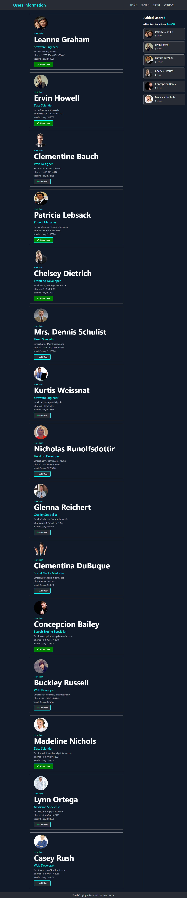

# USER PROFILES

It's a very simple user management system which developed using React.js.

## What's included
 - All USER profiles showed in Homepage.
 - User could be added by clicking add user using react state hook.
 - Added users total salary also showed in sidebar.

## Installation
### Prerequisites
In order to install USER PROFILE APP, the following prerequisites must be installed:
 - NPM 
 - Git

### Download
1. Open your command line and run:
```js
$ git clone https://github.com/nazmul98/users-profile.git
```

### Installation Process
In order to install, the following steps must be taken:

1. Open your command line, go to the extracted folder and run:
```js
$  npm install
$  npm start
```

### How I built it
The web application is built on React.js, React Font Awesome, HTML5, CSS3 etc. 

### Useful Links
 - Demo: https://usersprofile.netlify.com/

### Screenshot of Homepage
 